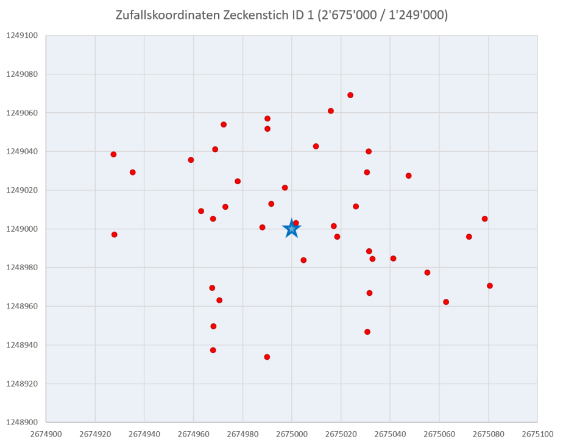
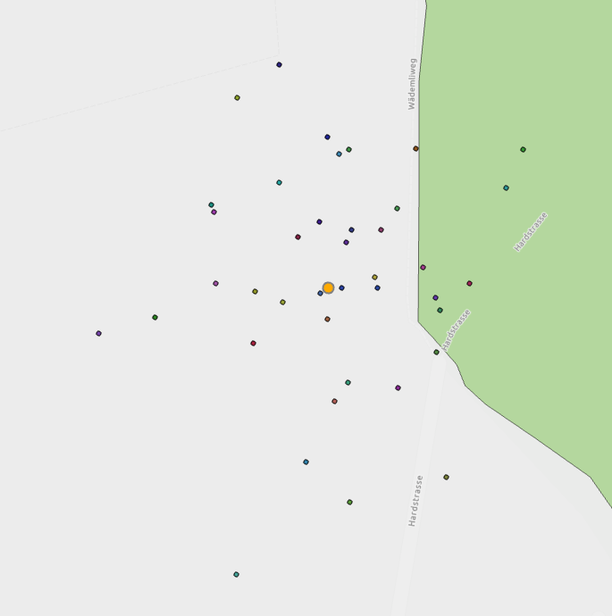

## Datenvorverarbeitung

Da der/die App Nutzer(in) den exakten Standort des Zeckenstichs nur mit eingeschränkter Positions-genauigkeit erfassen kann (abhängig von Zoomstufe in der Karte und individueller räumlicher Orientierungs-kompetenz), wird davon ausgegangen, dass die erfassten Standorte über eine Unsicherheit verfügen. Um die Auswirkung dieser Unsicherheit auf den Anteil im Wald liegender Stiche simulieren zu können, wurden die 1076 Originalkoordinaten in 40 Monte Carlo Durchgängen (Runs) zufälliger in einem Bereich +/-100 Meter versetzt, bildlich gesprochen wurden die Punkte etwas "verschüttelt". Diese Zufallskoordinaten wurden in Excel generiert. Untenstehende Abbildung zeigt beispielhaft für Zeckenstichstandort mit ID 1 (blauer Stern = Originalstandort) die 40 zufälligen Standorte (rote Punkte).

Folgende Abbildung zeigt exemplarisch wie diese künstliche simulierte Ungenauigkeit eines Punktes Auswirkungen darauf hat, ob ein Punkt sich innerhalb oder ausserhalb des Waldes befindet (orange: Originalstandort). Bei 6 von 40 Durchgängen befindet sich der Standort (ID 15611) innerhalb des Waldes. Die Frage, welche beantwortet werden soll, lautet nun: Wie gross ist die Wahrscheinlichkeit, dass sich der mit einer bekannten Ungenauigkeit erfasste Zeckenstichstandort tatsächlich innerhalb des Waldes befindet? (vgl. Kap. 3 Unsicherheit der gemeldeten Zeckenstiche)

Bezüglich Unsicherheit von Geodaten stellt sich auch die Frage, wie genau kann überhaupt die Waldrandgrenze mittels einer Polygongrenze abgebildet werden? Handelt es sich um ein Objekt, welches eineindeutig klar definiert werden kann (grenzscharf) oder verfügt die Waldrandgrenze selber über eine Unschärfe? (vgl. Kap. 4 Unschärfe des Waldrandes)

## Übung 1: Daten erkunden und neues "Resultate" Feature Dataset erstellen

Downloade das Package, speichere es lokal auf Deinem Computer und entpacke die Datei. Öffne anschliessend das Projekt-File (*.aprx), erkunde die Daten und mache Dich mit ihnen vertraut.

Erstelle anschliessend in der Projekt-Geodatenbank Unsicherheit.gdb ein neues Feature Dataset mit dem Namen Resultate. Weise dem neuen Feature Dataset das Koordinatensystem CH1903+ LV95 zu.

In diesem neuen Feature Dataset sollen nachfolgend alle neu erstellten (Zwischen-)Resultate abgelegt werden.
