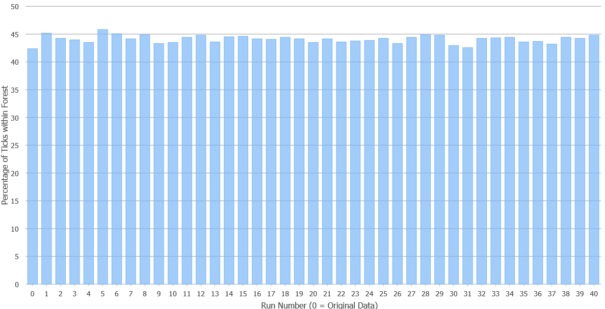

# Unsicherheit der gemeldeten Zeckenstichstandorte

Die erste Aufgabe besteht darin, zu untersuchen, wie gross der Einfluss der Erfassungsunsicherheit darauf ist, welcher Anteil der erfassten Zeckenstichstandorte inner- oder ausserhalb des Waldes liegen. Dabei soll der Fokus nur auf der Unsicherheit (der Erfassungsgenauigkeit) der Zeckenstichstandorte liegen.  

## Übung 2: Zusammenfassen (Merge) aller Runs zu einem Datensatz

Erstelle im Resultate Feature Dataset eine Feature Class, welche die Zeckenstichstandorte aller Runs und die Original-Standorte beinhaltet. Nutze hierfür das Geoverarbeitungswerkzeug Merge. Entferne dabei alle Felder mit Bezeichnung Run_1_x, Run_1_y, Run_2_x, Run_2_y etc. Alle anderen Attribute sollen beibehalten werden.

[Geoprocessing Tool Merge](https://pro.arcgis.com/en/pro-app/tool-reference/data-management/merge.htm)

Überprüfe das Resultat. Die Output Feature Class sollte anschliessend 44'116 Features beinhalten.  

## Übung 3: Summe der Stiche innerhalb der Waldfläche

Um zu überprüfen wie viele Stiche sich innerhalb des Waldes befinden muss zunächst der Punktlayer mit den Stichdaten aller Runs und den Originaldaten (Resultat aus Übung 2) mit dem Wald-Layer überlagert werden. Hierbei bietet sich das Geoverarbeitungswerkzeug Summarize Within (Analysis Tools) an. Dieses Werkzeug zählt alle Punkte welche sich in den jeweiligen Flächen des Input-Polygons befinden. Ausserdem kann damit eine separate Output Tabelle (Output Grouped Table) generiert werden, welche für jeden Run angibt (Group Field = Run_Nr), wie viele Punkt pro Run inner- oder ausserhalb des Waldes liegen.
Hinweis: Speichere die Output Grouped Table direkt auf Datenbank-Ebene und nicht im Feature Dataset Resultate. Ansonsten kann die Ausführung des Werkzeugs zu einem Fehler führen.

[Geoprocessing Tool Summarize Within](https://pro.arcgis.com/en/pro-app/tool-reference/analysis/summarize-within.htm)

Überprüfe anschliessend die beiden generierten Outputs (Tabelle und Feature Class). Welche Informationen sind darin enthalten? Was bedeuten die Werte in den Feldern Join ID, Run_Nr und Count of Points innerhalb der Output Grouped Table?

## Übung 4: Prozentualer Anteil der Stiche innerhalb des Waldes

Erweitere die Output Grouped Table (Resultat aus Übung 3) um ein Feld in dem Du anschliessend den prozentualen Anteil der Punkte pro Run innerhalb des Waldes berechnen kannst. 

Hinweis: Pro Run gibt es 1076 Features 

[Calculate Field](https://pro.arcgis.com/en/pro-app/tool-reference/data-management/calculate-field.htm)

## Übung 5: Diagramm (Bar Chart) mit prozentualem Anteil der individuellen Runs

Erstelle zuerst eine Kopie der Output Grouped Table in der Projekt-Geodatenbank. Entferne nachfolgend in der soeben erstellten Kopie alle Records welche die Summen der Stiche ausserhalb des Waldes beinhalten. 

Hinweis: beachte die Werte im Feld *Join_ID*

[Select Layer By Attribute](https://pro.arcgis.com/en/pro-app/tool-reference/data-management/select-layer-by-attribute.htm)

Erstelle anschliessend ein Balkendiagramm welches die unterschiedlichen prozentualen Anteile der Stiche innerhalb des Waldes pro Run symbolisiert. Gehe hierfür in das Menüband Standalone Table und wähle Create Chart.  

Beachte die Werte und deren Spannweite. Was bedeuten die Werte? Was für Aussagen bezüglich Unsicherheit (Genauigkeit) können bei den Stichdaten gemacht werden?

## Übung 6: Berechnung des Mittelwertes aller Runs

Nutze die Tabelle der in Übung 3 erstellten Feature Class und berechne den prozentualen Anteil aller Stiche (über alle Runs) welche sich innerhalb des Waldes befinden. Vergleiche diesen Wert mit dem Wert aus den Originaldaten.
__________________________________________________________________________